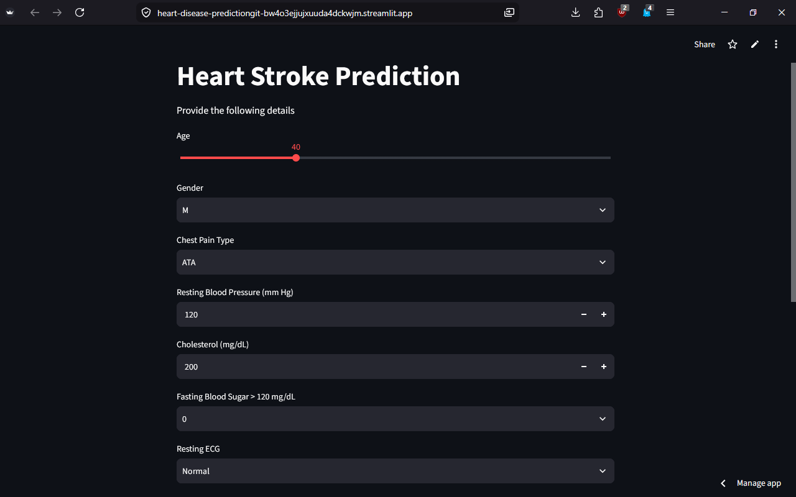
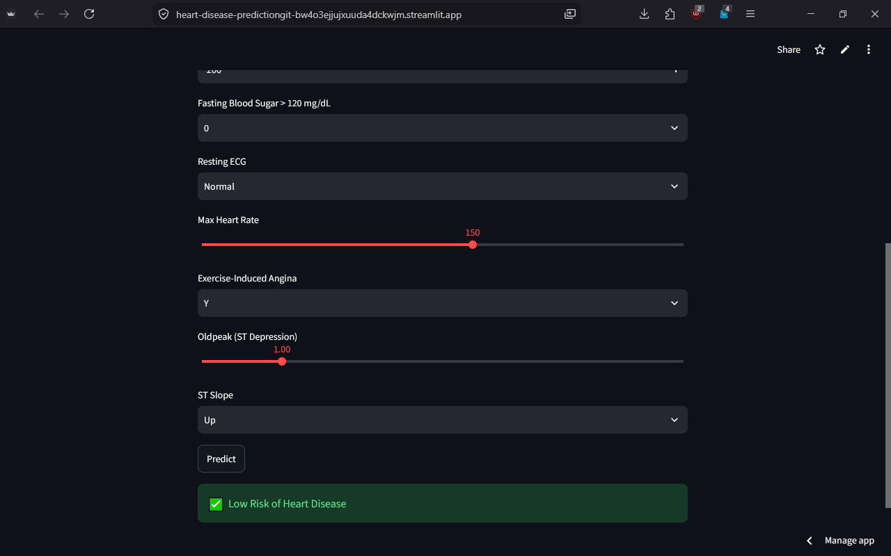
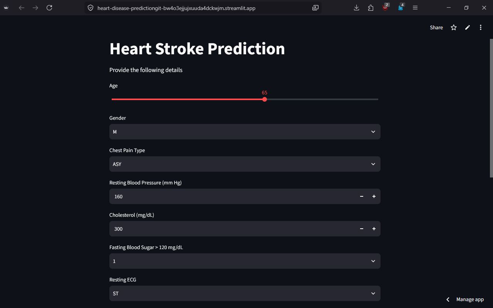
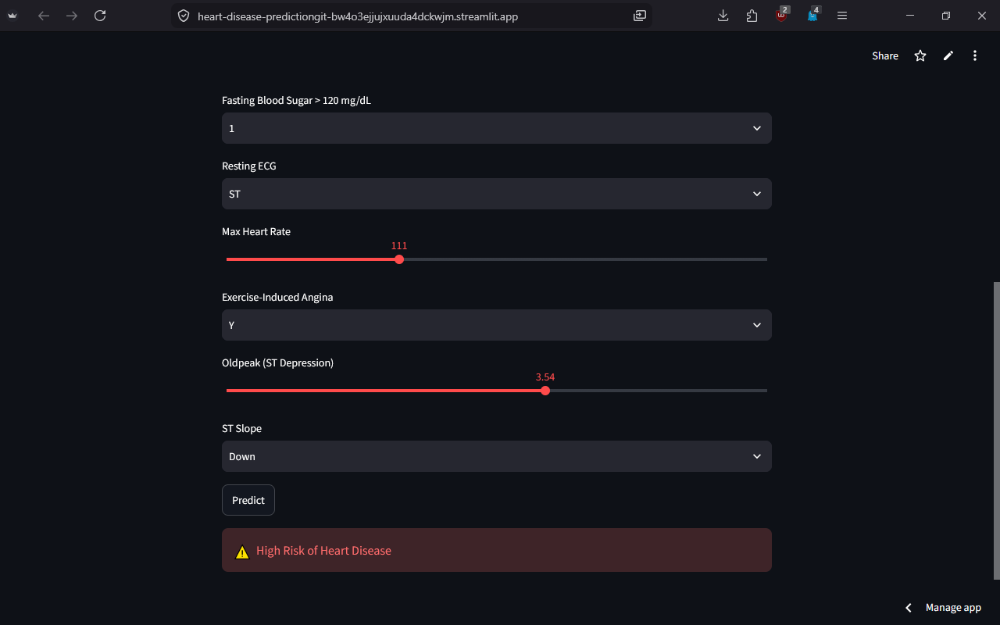

# ❤️ Heart Disease Prediction using Machine Learning

<p align="center">


</p>

A Machine Learning-powered web application that predicts the likelihood of heart disease based on a patient's medical information. The application is built using **Python**, **Scikit-learn**, and **Streamlit**, providing an intuitive interface for real-time predictions.

---

## 📌 Project Overview

Cardiovascular diseases are among the leading causes of death worldwide. Early prediction can assist healthcare professionals in making informed decisions.

This project leverages a **K-Nearest Neighbors (KNN)** classification model trained on a heart disease dataset to estimate whether a patient is likely to have heart disease based on clinical parameters.

---

## ✨ Features

* Modern and user-friendly Streamlit interface
* Real-time heart disease prediction
* Machine Learning model trained using KNN
* Data preprocessing and feature scaling
* One-click prediction
* Clean and responsive UI
* Easy to deploy on Streamlit Community Cloud

---

## 🧠 Machine Learning Workflow

```
Dataset
    │
    ▼
Data Cleaning
    │
    ▼
Feature Encoding
    │
    ▼
Feature Scaling
    │
    ▼
Train-Test Split
    │
    ▼
KNN Model Training
    │
    ▼
Model Evaluation
    │
    ▼
Model Saving (.pkl)
    │
    ▼
Streamlit Web Application
```

---

## 📂 Project Structure

```
Heart-Disease-Prediction/
│
├── app.py
├── KNN_heart.pkl
├── scaler.pkl
├── columns.pkl
├── requirements.txt
├── README.md
├── .gitignore
├── screenshots/
│     ├── ss1.png
│     ├── ss2.png
|     ├── ss3.png
│     └── ss4.png
└── dataset/
      └── heart.csv
```

---

## 📊 Dataset Features

The model uses the following patient attributes:

* Age
* Sex
* Chest Pain Type
* Resting Blood Pressure
* Cholesterol
* Fasting Blood Sugar
* Resting ECG
* Maximum Heart Rate
* Exercise-Induced Angina
* ST Depression (Oldpeak)
* ST Slope

---

## ⚙️ Technologies Used

| Technology   | Purpose               |
| ------------ | --------------------- |
| Python       | Programming Language  |
| Pandas       | Data Processing       |
| NumPy        | Numerical Computation |
| Scikit-learn | Machine Learning      |
| Joblib       | Model Serialization   |
| Streamlit    | Web Application       |

---

## 🚀 Installation

### Clone the repository

```bash
git clone https://github.com/PulkitKagra/Heart-Disease-Prediction.git
```

### Navigate to the project

```bash
cd Heart-Disease-Prediction
```

### Install dependencies

```bash
pip install -r requirements.txt
```

### Run the application

```bash
streamlit run app.py
```

---

## 📸 Screenshots

### 1



### 2



### 3



### 4



---

## 🎯 Future Improvements

* Add probability/confidence score
* Compare multiple ML algorithms
* Hyperparameter tuning
* Docker deployment
* User authentication
* Cloud deployment with CI/CD
* Model explainability using SHAP

---

## 👨‍💻 Author

**Pulkit Dev Kagra**

B.Tech (ECE - AIML)

Passionate about Machine Learning, Artificial Intelligence, Data Science, and Software Development.

GitHub: https://github.com/PulkitKagra

LinkedIn: (https://www.linkedin.com/in/pulkit-dev-kagra/)

---

## ⭐ Support

If you found this project helpful, consider giving it a ⭐ on GitHub. Your support helps motivate future improvements and makes the project more visible to others.
